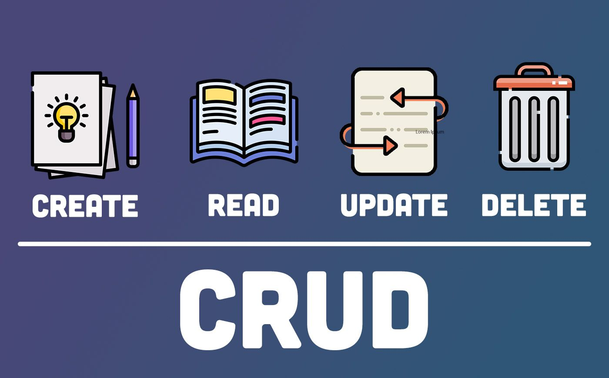

# A CRUD application for a JSON file (C#/.NET)
Creating a CRUD (Create, Read, Update, Delete) application for a JSON file is a common task in software development. This type of project involves building a system that allows users to interact with a JSON file by performing these basic operations. 

## Table of Contents

- [A CRUD application for a JSON file (C#/.NET)](#a-crud-application-for-a-json-file-cnet)
  - [Table of Contents](#table-of-contents)
  - [Introduction](#introduction)
  - [Goals](#goals)
  - [Getting Started](#getting-started)
    - [Prerequisites](#prerequisites)
    - [Installation](#installation)

## Introduction

The JSON File CRUD Application is a software system that enables users to manage data stored in a JSON file. Users can create new records, read existing data, update records, and delete entries from the JSON file. This project is often used for managing various types of structured data, such as customer information, product catalog, or configuration settings.

## Goals  
- Create: Allow users to add new data entries to the JSON file.

- Read: Enable users to view the existing data stored in the JSON file.
- Update: Permit users to modify the information in the JSON file.
- Delete: Allow users to remove data entries from the JSON file.
- Data Validation: Implement data validation to ensure the integrity and consistency of the data.
- User-Friendly Interface: Create a user-friendly interface for easy interaction with the JSON file.

## Getting Started

To start using the web scraper, follow these steps:

### Prerequisites

Before running the Application, make sure you have the following prerequisites installed:

- Visual Studio Code
- Git
- You need these NuGet Packages 
	> Newtonsoft.Json  
	> ConsoleTables  

### Installation

1. Create a C# Console Project in Visual Studio Code and remove the Program.cs file, which contains the Main function.

2. Clone this Repository:

   ```sh
    git clone https://github.com/arashalghasi/CrudJson.git 
   ```  

3. add the packages mentioned about to the project by:  
    ```sh
    dotnet add package Newtonsoft.Json
    dotnet add package ConsoleTables
    ```
4. run the program with the command :

    ```sh
    dotnet run program.cs
    ```
5. Copy full-path of the file result.json to the console app

6. Have a happy crud CRUDER !!!
